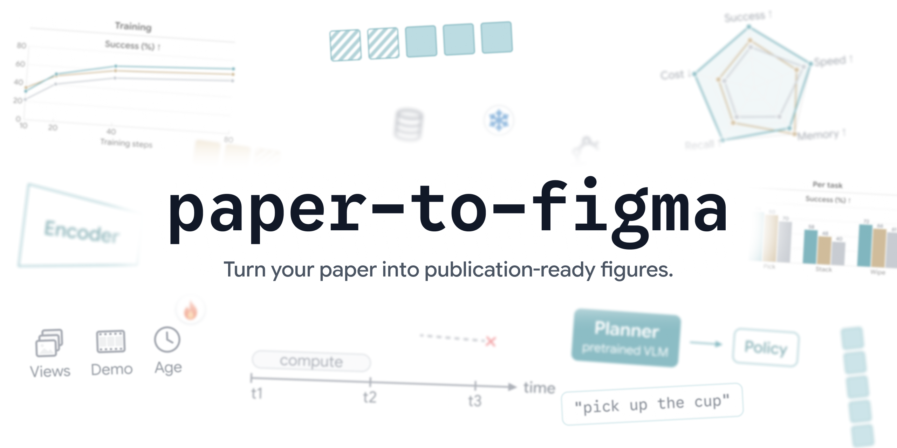
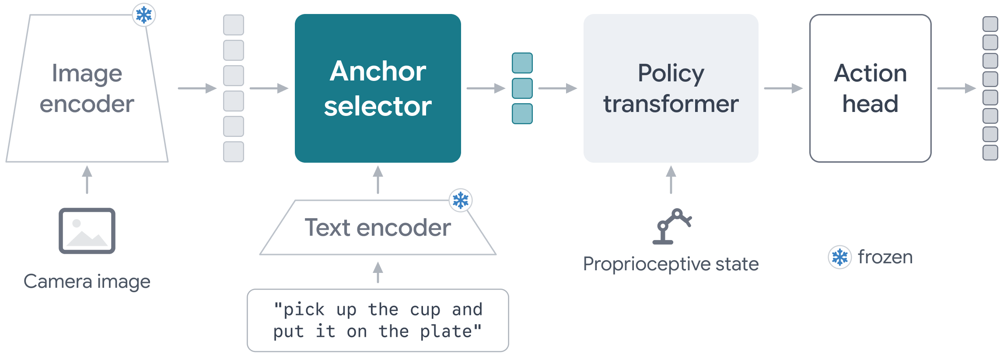
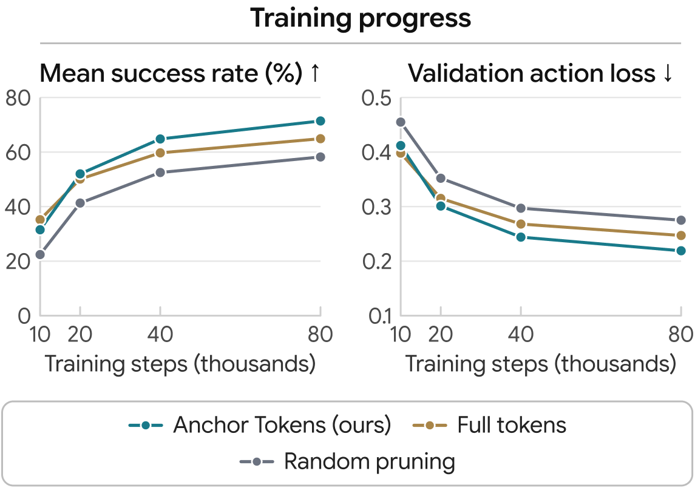
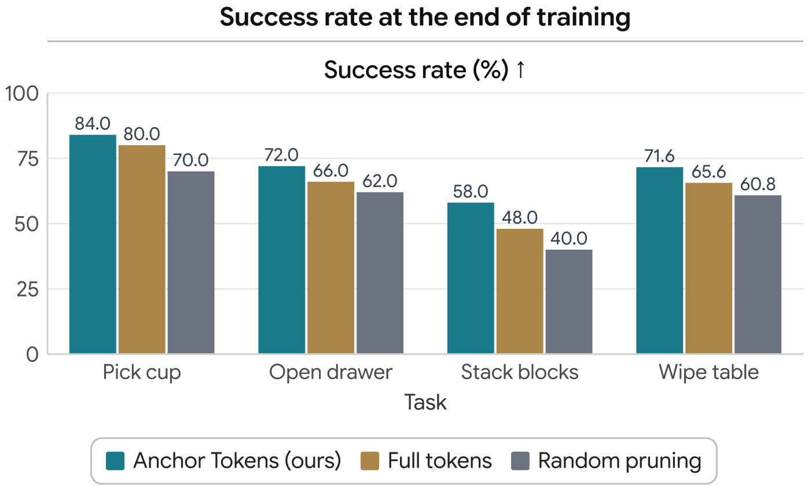
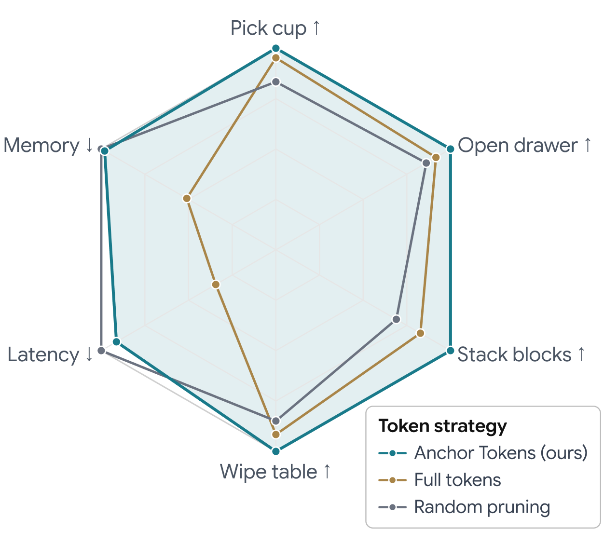

<p align="center"></p>

<h3 align="center">Turn your paper into publication-ready figures.</h3>

<p align="center">
An agent reads your draft and draws its figures as editable Figma frames.<br>
Every number is checked against the paper, every label is sized for print. No design skills needed.
</p>

<p align="center">
<a href="https://github.com/JeonSeongHu/paper-to-figma/actions/workflows/ci.yml"></a>
<a href="LICENSE"></a>


</p>

<p align="center">
<a href="#quick-start">Quick start</a> ·
<a href="#gallery">Gallery</a> ·
<a href="#how-it-works">How it works</a> ·
<a href="docs/figure-principles.md">Figure principles</a> ·
<a href="docs/quickstart.ko.md">한국어 실행법</a>
</p>

---

A paper's figures get redrawn many times: the text is too small at print size, a number no longer matches the table,
the PDF turns into black boxes in a reviewer's viewer, a diagram says in sentences what it should show. paper-to-figma
hands that work to an agent and holds it to rules measured on figures researchers approved.

## Features

- **From the paper's text.** TeX, Markdown or text extracted from a PDF. `prepare` indexes captions, tables with addressable cells, and the sketches authors leave inside figure placeholders.
- **Every number checked.** Each value in a chart cites a table cell or a quoted clause, and must match the paper at the printed precision. Nothing is estimated or smoothed.
- **Sized for print.** Text, lines and arrows follow a size spec measured on approved figures, judged at the size the figure will be printed. Text never shrinks to fit.
- **Editable, not a picture.** Every figure is a Figma frame built from auto-layout parts: change a label, move a block, recolour a method.
- **Charts that lay themselves out.** Line and bar charts, broken and log axes, and radars, fitted to a full-width or a one-column format.
- **Diagrams with a visual grammar.** Three hierarchy levels, icons for inputs, time axes and duration bars, dashed optional paths, blocked links, state badges only where they tell something.
- **Safe PDFs.** No clipping masks and no transparency; every export is rendered once more with transparency off and compared.
- **Works with your agent.** A Claude Code plugin (skill and MCP server), an MCP server for other clients, and a plain CLI.

## Gallery

All four come from the synthetic example paper in [`examples/anon-paper`](examples/anon-paper): its method and numbers are invented.

<table>
<tr>
<td colspan="2"><br><sub>Method overview: one accent block for the contribution, inputs as icons, only the rarer state (frozen) marked.</sub></td>
</tr>
<tr>
<td width="50%"><br><sub>Training curves, laid out as a one-column figure.</sub></td>
<td width="50%"><br><sub>Per-task success, every value checked against the paper's table.</sub></td>
</tr>
<tr>
<td width="50%"><br><sub>Summary radar: each axis scaled by its best method, labels and lines at chart size.</sub></td>
<td width="50%" valign="top"><sub>The radar keeps the axes where the proposed method is not the best (latency, memory). Figures report what the paper reports.</sub></td>
</tr>
</table>

## How it works

1. **`prepare`** indexes the paper into `work/<name>/`: the text, captions, the authors' figure sketches, and tables with addressable cells.
2. **Plan.** The agent writes one line per figure: the question it answers, its purpose, its format, what goes in and what stays out. The [skill](skills/paper-to-figma/SKILL.md) and the [principles](docs/figure-principles.md) decide.
3. **Draw.** Data figures are JSON specs (`check`, then `build`); diagrams are short scripts that use the kit.
4. **`verify`** exports the PDF and runs every check; the agent then reads the renders against a checklist and repeats until clean.

## Quick start

```bash
git clone https://github.com/JeonSeongHu/paper-to-figma.git
cd paper-to-figma
bun install && bun run build && bun test
bun run setup            # prints a private pairing code
bun run relay            # keep this terminal open
```

In Figma desktop: **Plugins > Development > Import plugin from manifest**, choose `plugin/manifest.json`, run
**Paper to Figma**, paste the code, **Connect**. Then try the example:

```bash
bun run doctor
bun src/cli.mjs prepare examples/anon-paper --name anchor
bun src/cli.mjs build examples/anon-paper/figures/training-curves.json --paper anchor --page "Figures"
bun src/cli.mjs verify "Anchor Tokens / training curves" --paper anchor --page "Figures" --spec examples/anon-paper/figures/training-curves.json
```

An existing Talk to Figma setup with an `execute_code` command also works: set `P2F_TRANSPORT=talk-to-figma` and
`P2F_CHANNEL=<channel>`. The PDF checks need Python 3.9+ with PyMuPDF and NumPy; Ghostscript enables the strict-viewer render.

### Use it from your agent

Claude Code (skill and MCP server together):

```bash
claude plugin marketplace add JeonSeongHu/paper-to-figma --scope project
claude plugin install paper-to-figma@paper-to-figma
```

Codex: `codex mcp add paper-to-figma -- bun /path/to/paper-to-figma/src/mcp.mjs`, and point it at
`skills/paper-to-figma/SKILL.md` (`bun run setup` prints both).

Then ask: *"Use the paper-to-figma skill to make the figures of work/mypaper/paper.txt on the Figures page and verify each one."*

## CLI

```
prepare <paper> --name N       index a paper into work/N/ (text, captions, figure sketches, tables with addressable cells)
check <spec.json> --paper N    fill in the layout, gate the design, check every value against the paper
build <spec.json> --paper N    check, then draw in Figma (a frame with the same name is replaced in place)
script <file.js>               run a figure script with the kit (diagrams, teasers); --spec S passes checked numbers
export | inspect | lint <frame>
qa <file.pdf>                  PDF checks and strict-viewer render
verify <frame> --paper N       export + qa + lint (+ evidence with --spec); writes work/N/verify-<frame>.md
```

## Why the checks exist

Each check comes from a failure in real figures:

- **Text shrinks.** Language models shrink text until everything fits. The size spec was measured on figures the author approved after repeated "make the text bigger" rounds; `lint` fails text under 1.2 % of the figure width at print size.
- **Numbers drift.** `check` refuses any value without a source in the paper, and any value that differs from the printed one at the printed precision. Numbers that appear only in the authors' figure sketches are not evidence.
- **PDFs break in some viewers.** Figma writes clipping frames and masks as soft masks, which some viewers draw as black boxes; viewers that ignore transparency paint translucent fills solid.
- **Layouts stretch.** Two chart panels spread over the full width make 2.5 px lines look thin. The layout step keeps plot areas at the approved size and fits one of the two paper formats instead.
- **Diagrams drift into prose, or into puzzles.** Unchecked, agents write sentences into boxes; told to cut words, they leave icons nobody can decode. `lint` counts label words against a budget and flags long or repeated labels, unnamed icons, long blocked links, badges on most modules, and lower-level elements drawn larger than higher ones.
- **Space goes to waste.** A hole check finds empty rectangles, and a coverage measure catches space cut into pieces by thin lines.
- **Colours change meaning.** `check` records which method each colour stands for across the paper; diagrams declare their colour meanings and `verify` compares them.

## Repository layout

| Path | What it holds |
|---|---|
| `kit/` | Figure kit that runs inside Figma: size spec, chart layout, charts and radar, diagram parts. `dist/kit.js` is the built bundle |
| `plugin/` | Figma development plugin with a pairing code; `code.js` is the built bundle |
| `src/` | Relay, CLI, MCP server, paper indexing, evidence check, colour record, design lint, verification |
| `scripts/pdf_qa.py` | PDF checks: soft masks, transparency, placeholder images, margins, empty regions, coverage, strict-viewer render |
| `skills/paper-to-figma/` | The agent skill |
| `docs/` | Principles, spec format, kit API, local setup; `assets/` holds the README images and the script that draws the teaser |
| `examples/anon-paper/` | A synthetic paper with chart specs and a diagram script |
| `tests/` | `bun test` |

`work/` (papers and their figures) and `.private/` (the pairing code) are not tracked.

## Roadmap

- A published Figma plugin (the manifest ID is a development placeholder today)
- A labelled horizontal bar part for result panels inside diagrams
- A check that spots words broken across lines inside fixed-width boxes
- More paper sources: LaTeX projects with `\input` trees, and PDF layout instead of plain text

## Limits

- The paper parser does not compile TeX. Tables from PDF text are marked low confidence.
- Charts and radars are laid out automatically. Diagrams are scripts: the kit refuses a diagram that grows past its declared width or format, and lint checks the rest.
- Automated checks do not judge emphasis, wording, whether a mechanism reads, or whether a figure answers the right question. The skill's render checklist covers these; the agent must look at the renders.

## Contributing

Issues and pull requests are welcome. Every rule in this repository started as a correction to a real figure; see
[CONTRIBUTING.md](CONTRIBUTING.md) for how to propose a new one or turn it into a check. Please follow the
[code of conduct](CODE_OF_CONDUCT.md), and report security problems as described in [SECURITY.md](SECURITY.md).

## Citation

If paper-to-figma helped with the figures of your paper, you can cite it with the metadata in [CITATION.cff](CITATION.cff)
(GitHub shows a "Cite this repository" button).

## Acknowledgements

paper-to-figma extends [tex-to-figma-poster](https://github.com/JeonSeongHu/tex-to-figma-poster) from posters to paper
figures and reuses its local relay, pairing and plugin design. The Talk to Figma transport works with plugins that
expose an `execute_code` command.

## License

[MIT](LICENSE)
